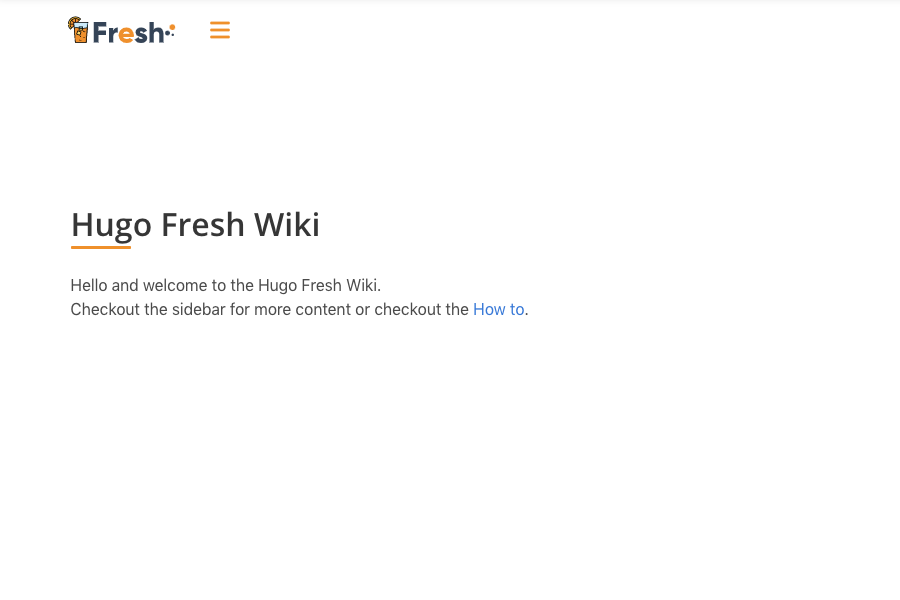

# hugo-fresh-wiki theme for Hugo

This is basically a fork of the origin [`hugo-fresh` theme](https://github.com/stefma/hugo-fresh)
but without the main or entry page.
This theme supports only "single pages" in a "wiki" style.



## How to
Simply add your `markdown` files (togehter with a empty `_index.md` file)
into the `content` directory.

### Header
The header for each markdown file should look like the following:
```
---
title: Title
sidebar: true
sidebarlogo: fresh-white-alt // Logo from `static/images/logo`
---
```

### Config
This is the configuration you need inside your `config.yaml`:
```
params:
  navbarlogo:
  # Logo (from static/images/logos/___)
   image: logos/fresh.svg
   link: /
  font:
    name: "Open Sans"
    sizes: [400,600]
```

## About this fork

Unfortunately you can't fork you own repository at GitHub.
Therefore I've used the GitHub importer to create a 100% clone of it.

That means the history and everything is the same as from `hugo-fresh`.
But it isn't visible for other users. But if we want to merge something
from the upstream project we could do this easily...
